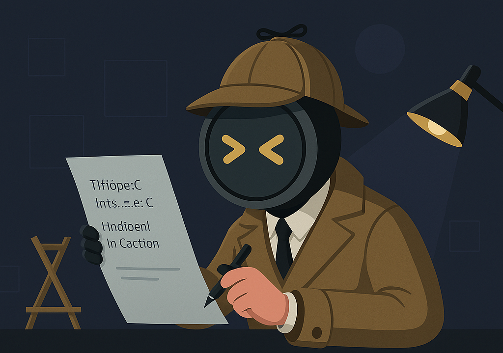

# 🕵️‍♂️ **ByteSleuth** — The Ghost Hunter for Hidden Characters

> "Elementary, my dear dev. The ghosts of hidden characters won't escape this audit!"
> — **CharlockHolmes**, the detective inside ByteSleuth

ByteSleuth is a **powerful Unicode & ASCII character scanner** designed to detect obfuscation, invisible threats, and suspicious bytes lurking in text or code. Whether you're hunting down **ghost characters** or analyzing **unexpected encoding issues**, ByteSleuth ensures a **clean and transparent result**.

---

## 🚀 **Key Features**
- ✅ Detects **ASCII control characters** (e.g., `NUL`, `BEL`, `ESC`)
- ✅ Flags **Unicode invisibles** and **directional controls** (e.g., `U+200B`, `U+202E`)
- ✅ Optionally **sanitizes** input by removing hidden/malicious characters
- ✅ Works seamlessly with **files**, **directories**, and **stdin/PIPE**
- ✅ Supports **logging** for audit trails
- ✅ Generates **SHA256 hash** before/after sanitization
- ✅ Outputs **JSON reports** (stdout or file)
- ✅ **Concurrent directory scanning** for speed
- ✅ **Fail on detect** mode for CI/CD/pre-commit
- ✅ **Backup/restore** before sanitization
- ✅ **VSCode extension** for easy integration
- ✅ **Pre-commit & CI/CD integration** examples
- ✅ **Real-world examples** included

---

## 🔧 **CLI Usage**

```bash
python src/byte_sleuth.py <target> [options]
```

### **CLI Options**
| Option | Description |
|--------|-------------|
| `target` | File or directory to scan (or use PIPE input) |
| `-s`, `--sanitize` | Automatically remove suspicious characters |
| `-l`, `--log` | Log file to write results (default: `scanner.log`) |
| `-r`, `--report [file]` | Print JSON report to stdout or save to file |
| `-f`, `--no-backup` | Disable backup creation |
| `-v`, `--verbose` | Enable verbose output (shows hashes, findings) |
| `-d`, `--debug` | Enable debug output |
| `-q`, `--quiet` | Suppress all output except errors |
| `-S`, `--sanitize-only` | Only sanitize, do not scan/report |
| `-F`, `--fail-on-detect` | Exit with code 1 if suspicious characters are found |
| `-V`, `--version` | Show version and exit |

### **CLI Examples**
```bash
python src/byte_sleuth.py suspicious.txt -s -v
python src/byte_sleuth.py ./data/ -r report.json
cat file.txt | python src/byte_sleuth.py -s > sanitized.txt
python src/byte_sleuth.py src/ -F  # For CI/pre-commit: fail if any issue found
```

---

## 📦 **Using ByteSleuth in Your Python Projects**

### **Installation**
Once published to PyPI:
```bash
pip install byte-sleuth
```

### **Basic Usage in Python**
```python
from byte_sleuth import ByteSleuth
scanner = ByteSleuth(sanitize=True)
findings = scanner.scan_file("example.txt")
for cp, name, char, idx in findings:
    print(f"⚠️ Suspicious Character: {name} (U+{cp:04X}) at position {idx} → {repr(char)}")
```

---

## 🔁 **Automation & Integration**
- **Pre-commit hook**: Block commits with hidden characters
- **CI/CD pipelines**: Fail builds if issues are found
- **VSCode extension**: Scan open files with one click
- **JSON reports**: For audit or further automation

### **Pre-commit Example**
```yaml
# .pre-commit-config.yaml
- repo: local
  hooks:
    - id: byte-sleuth-scan
      name: ByteSleuth Unicode & ASCII Scanner
      entry: python src/byte_sleuth.py src/ -F
      language: system
      pass_filenames: false
```

### **GitHub Actions Example**
```yaml
- name: Scan for hidden characters
  run: python src/byte_sleuth.py src/ -F
```

---

## 🧑‍💻 **VSCode Extension**
- Scan the current file for hidden/suspicious characters
- See results directly in VSCode
- Easy to install and use (see `vscode-extension/README.md`)

---

## 🧠 **Why Use ByteSleuth?**
Some characters are **invisible but dangerous**—causing confusion in **source code, configs, or documents**. Common attack vectors include:
- Zero-width spaces for code obfuscation
- Bidirectional override characters
- Hidden ASCII control codes
- Formatting trickery affecting debugging & diffs

ByteSleuth gives you a **detective's magnifying glass** to **expose them all**. 🔍

---

## 🚀 **Roadmap**
- [x] Expand sanitization methods
- [x] Improve CLI interactivity
- [x] Output JSON reports
- [x] VSCode Extension
- [ ] HTML reports
- [ ] Support for more file formats (zip, PDF, etc.)
- [ ] Public changelog/roadmap

---

## 📄 **License**
MIT — *Feel free to sleuth away!*
